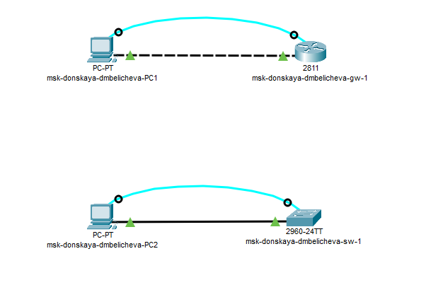
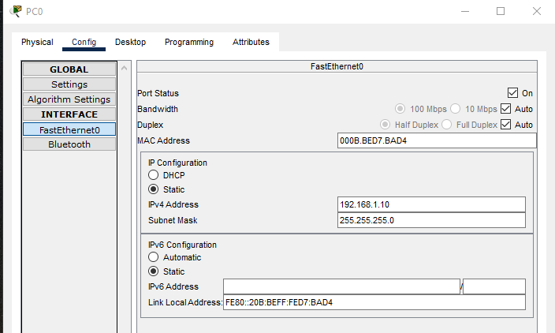
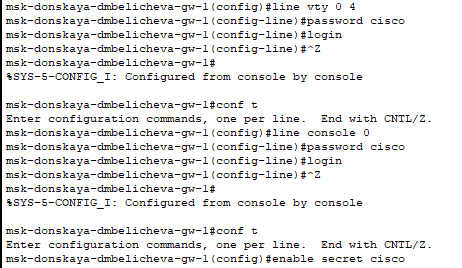
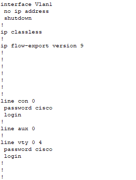
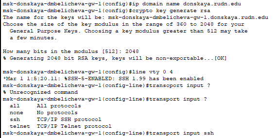
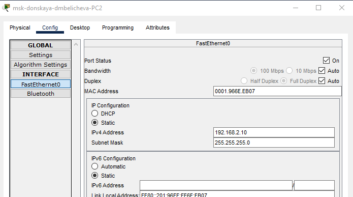
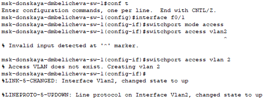
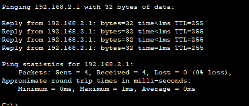
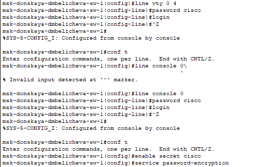
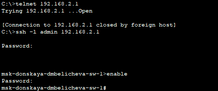

---
## Front matter
lang: ru-RU
title: Лабораторная работа №2
subtitle: Предварительная настройка оборудования Cisco
author:
  - Беличева Д. М.
institute:
  - Российский университет дружбы народов, Москва, Россия

## i18n babel
babel-lang: russian
babel-otherlangs: english

## Formatting pdf
toc: false
toc-title: Содержание
slide_level: 2
aspectratio: 169
section-titles: true
theme: metropolis
header-includes:
 - \metroset{progressbar=frametitle,sectionpage=progressbar,numbering=fraction}
 - '\makeatletter'
 - '\beamer@ignorenonframefalse'
 - '\makeatother'
---

# Информация

## Докладчик

:::::::::::::: {.columns align=center}
::: {.column width="70%"}

  * Беличева Дарья Михайловна
  * студентка
  * Российский университет дружбы народов
  * [1032216453@pfur.ru](mailto:1032216453@pfur.ru)
  * <https://dmbelicheva.github.io/ru/>

:::
::: {.column width="25%"}

:::
::::::::::::::

## Цель работы

Получить основные навыки по начальному конфигурированию оборудования Cisco.

## Задание

1. Сделать предварительную настройку маршрутизатора.

2. Сделать предварительную настройку коммутатора.

## Выполнение лабораторной работы

{#fig:001 width=70%}

## Выполнение лабораторной работы

{#fig:002 width=70%}

## Настройка маршрутизатора

{#fig:003 width=70%}

## Настройка маршрутизатора

{#fig:004 width=70%}

## Настройка маршрутизатора

{#fig:005 width=70%}

## Настройка маршрутизатора

{#fig:006 width=70%}

## Настройка маршрутизатора

{#fig:007 width=30%}

## Настройка маршрутизатора

{#fig:008 width=70%}

## Настройка маршрутизатора

{#fig:009 width=30%}

## Настройка маршрутизатора

{#fig:010 width=70%}

## Настройка маршрутизатора

{#fig:011 width=70%}

## Настройка маршрутизатора

{#fig:012 width=70%}

## Настройка маршрутизатора

{#fig:013 width=70%}

## Настройка коммутатора

{#fig:014 width=70%}

## Настройка коммутатора

{#fig:015 width=70%}

## Настройка коммутатора

{#fig:016 width=70%}

## Настройка коммутатора

{#fig:017 width=70%}

## Настройка коммутатора

{#fig:016 width=70%}

## Настройка коммутатора

{#fig:019 width=70%}

## Настройка коммутатора

{#fig:020 width=70%}

## Настройка коммутатора

{#fig:021 width=70%}

## Настройка коммутатора

{#fig:022 width=70%}

## Настройка коммутатора

{#fig:023 width=70%}

## Выводы

В процессе выполнения данной лабораторной работы я получила основные навыки по начальному конфигурированию оборудования Cisco.