---
## Front matter
lang: ru-RU
title: Лабораторная работа №16
subtitle: Настройка VPN
author:
  - Беличева Д. М.
institute:
  - Российский университет дружбы народов, Москва, Россия

## i18n babel
babel-lang: russian
babel-otherlangs: english

## Formatting pdf
toc: false
toc-title: Содержание
slide_level: 2
aspectratio: 169
section-titles: true
theme: metropolis
header-includes:
 - \metroset{progressbar=frametitle,sectionpage=progressbar,numbering=fraction}
 - '\makeatletter'
 - '\beamer@ignorenonframefalse'
 - '\makeatother'
---

# Информация

## Докладчик

:::::::::::::: {.columns align=center}
::: {.column width="50%"}

  * Беличева Дарья Михайловна
  * студентка
  * Российский университет дружбы народов
  * [1032216453@pfur.ru](mailto:1032216453@pfur.ru)
  * <https://dmbelicheva.github.io/ru/>

:::
::: {.column width="25%"}

:::
::::::::::::::

## Цель работы

Получить навыки настройки VPN-туннеля через незащищённое Интернет-соединение.

## Задание

1. Разместить в рабочей области проекта в соответствии с модельными предположениями оборудование для сети Университета г. Пиза.
2. В физической рабочей области проекта создать город Пиза, здание Университета г. Пиза. Переместить туда соответствующее оборудование.
3. Сделать первоначальную настройку и настройку интерфейсов оборудования
сети Университета г. Пиза.
4. Настроить VPN на основе протокола GRE.
5. Проверить доступность узлов сети Университета г. Пиза с ноутбука администратора сети «Донская».

## Выполнение лабораторной работы

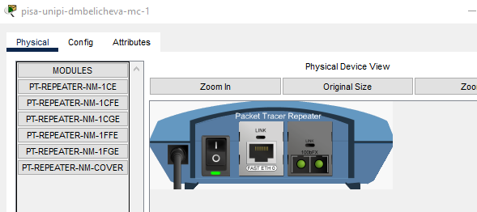{#fig:001 width=70%}

## Выполнение лабораторной работы

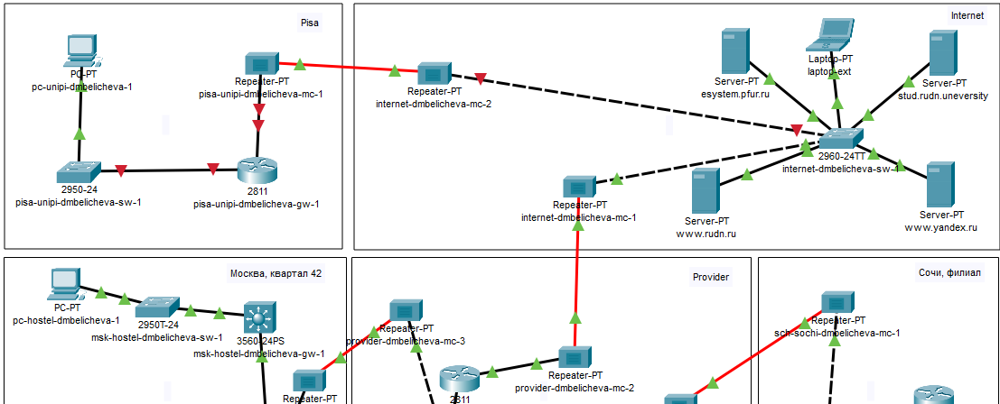{#fig:002 width=70%}

## Выполнение лабораторной работы

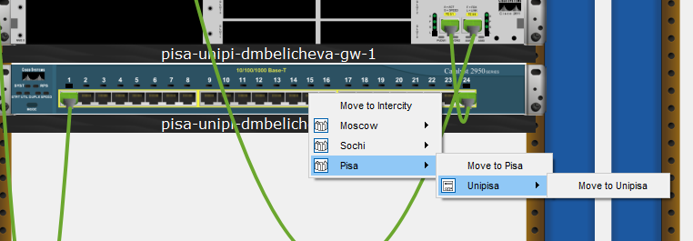{#fig:003 width=70%}

## Выполнение лабораторной работы

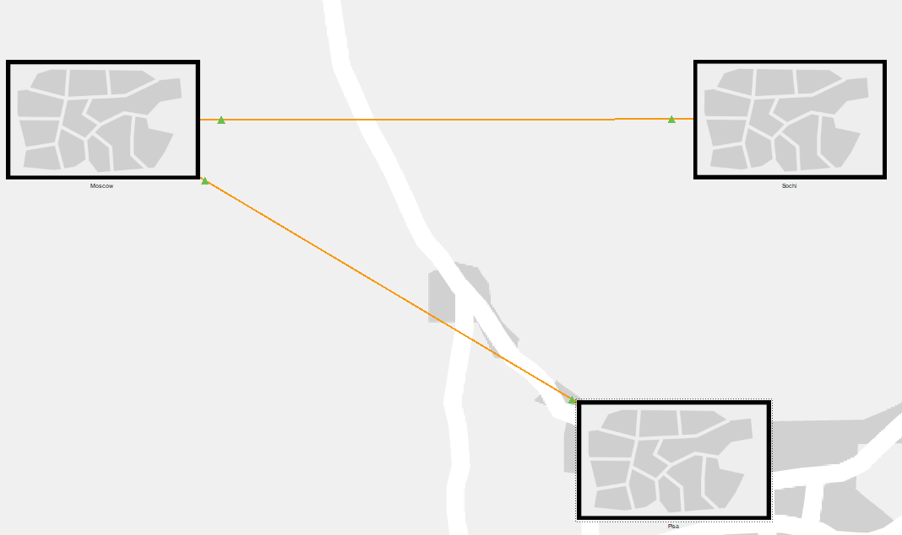{#fig:004 width=70%}

## Выполнение лабораторной работы

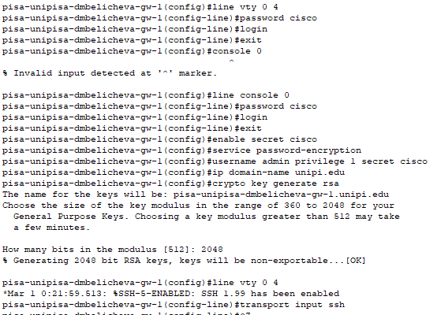{#fig:005 width=65%}

## Выполнение лабораторной работы

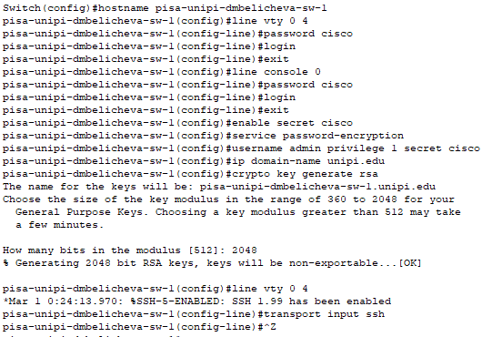{#fig:006 width=70%}

## Выполнение лабораторной работы

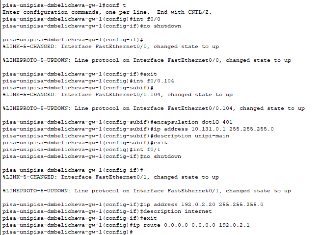{#fig:007 width=60%}

## Выполнение лабораторной работы

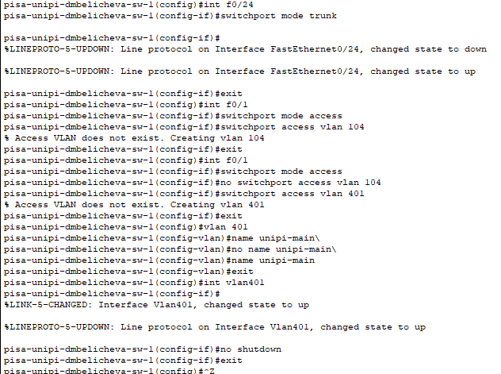{#fig:008 width=55%}

## Выполнение лабораторной работы

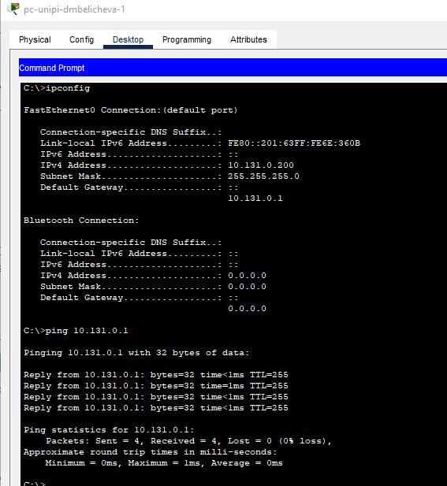{#fig:009 width=40%}

## Выполнение лабораторной работы

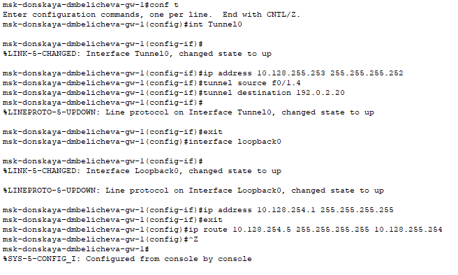{#fig:010 width=70%}

## Выполнение лабораторной работы

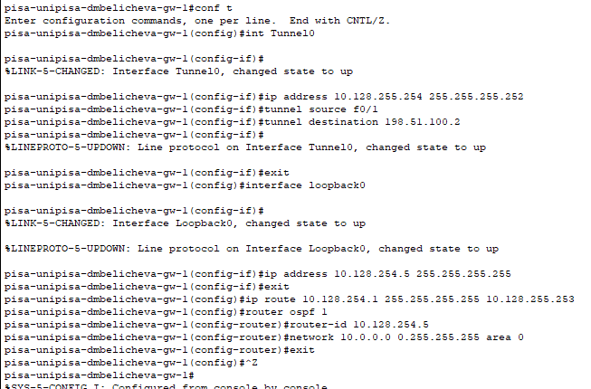{#fig:011 width=70%}

## Выполнение лабораторной работы

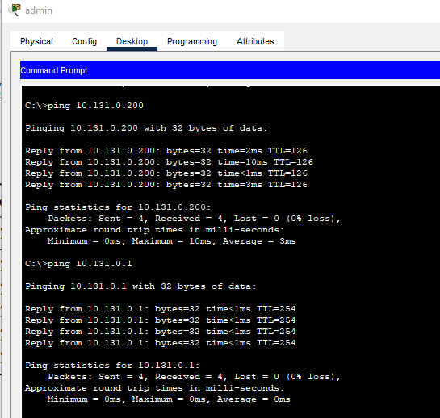{#fig:012 width=50%}

## Выводы

В результате выполнения данной лабораторной работы я получила навыки настройки VPN-туннеля через незащищённое Интернет-соединение.
