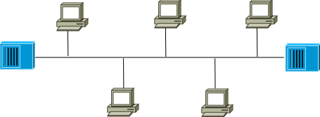
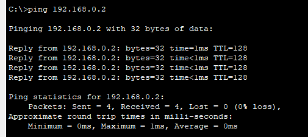
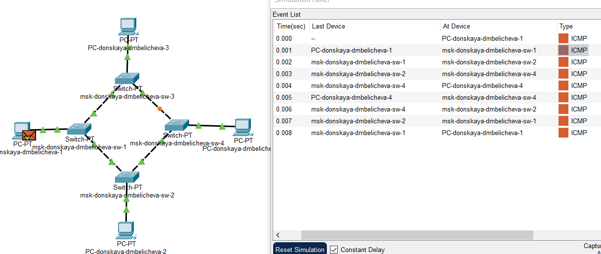
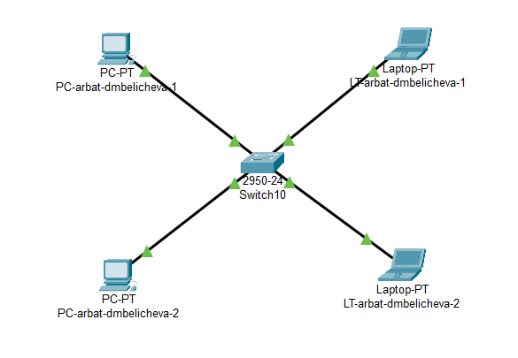
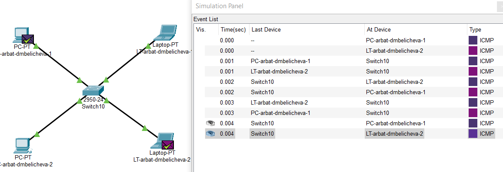

---
## Front matter
lang: ru-RU
title: Доклад
subtitle: Топология сети. Топологии типа «звезда», «кольцо», «шина».
author:
  - Беличева Д. М.
institute:
  - Российский университет дружбы народов, Москва, Россия

## i18n babel
babel-lang: russian
babel-otherlangs: english

## Formatting pdf
toc: false
toc-title: Содержание
slide_level: 2
aspectratio: 169
section-titles: true
theme: metropolis
header-includes:
 - \metroset{progressbar=frametitle,sectionpage=progressbar,numbering=fraction}
 - '\makeatletter'
 - '\beamer@ignorenonframefalse'
 - '\makeatother'
---

# Информация

## Докладчик

:::::::::::::: {.columns align=center}
::: {.column width="70%"}

  * Беличева Дарья Михайловна
  * студентка
  * Российский университет дружбы народов
  * [1032216453@pfur.ru](mailto:1032216453@pfur.ru)
  * <https://dmbelicheva.github.io/ru/>

:::
::: {.column width="25%"}

:::
::::::::::::::

# Вводная часть

**Цель работы**

Исследовать понятие топологии сети, а также рассмотреть конкретные топологии: "звезда", "кольцо", "шина".

**Задание**

* Изучить понятие топологии сети;
* Рассмотреть топологии "звезда", "кольцо", "шина";
* Реализовать рассмотренные топологии в Cisco Packet Tracer.

# Понятие топологии сети

Сетевая топология — это конфигурация графа, вершинам которого соответствуют конечные узлы сети, а рёбрам — физические или информационные связи между вершинами.

## Понятие топологии сети

Сетевая топология может быть представлена следующими видами:

* Физическая топология;

* Логическая топология;

* Информационная топология;

* Топология управления обменом.

## Понятие топологии сети

Различают следующие топологии компьютерных сетей:

* полносвязную;
* ячеистую;
* кольцевую;
* звездообразную («звезда»);
* древовидную;
* общую шину;
* смешанную.

# Топология "звезда"

:::::::::::::: {.columns align=center}
::: {.column width="50%"}

{#fig:001 width=100%}

:::
::: {.column width="50%"}

**Достоинства**:

* Выход из строя одной рабочей станции не останавливает сеть;
* Лёгкий поиск неисправностей в сети;
* Высокая производительность сети;

**Недостатки**:

* Выход из строя центрального концентратора обернётся неработоспособностью сети;
* Ограниченное число рабочих станций;
* Дороговизна.

:::
::::::::::::::

# Топология "кольцо"

{#fig:001 width=50%}

## Топология "кольцо"

**Достоинства**:

* Простота установки;
* Фактически полное отсутствие дополнительного оборудования.
* По протяженности сигнал не затухает;
* Невозможные коллизии (=>фиксированная задержка передачи данных).

**Недостатки**:

* Выход из строя любого узла или повреждение кабеля останавливает сеть;
* Ограниченность по количеству узлов;
* Сложный поиск неисправностей.

# Топология "шина"

{#fig:001 width=80%}

## Топология "шина"

**Преимущества**:

* Сравнительно простая настройка;
* Небольшая стоимость;
* Неисправность любого узла не влияет на работоспособность всей сети.

**Недостатками**:

* Неисправности в самой шине ведут к полному отказу сети;
* Достаточно сложный процесс поиска неисправностей.
* Низкий уровень производительности;
* Наличие плохой масштабируемости.

# Практическая реализация топологий

## Реализация топологии "кольцо"

{#fig:001 width=60%}

## Реализация топологии "кольцо"

:Таблица ip-адресов

| №   | Устройство                 | IPv4-адрес  | Маска подсети |
| --- | ---------------------------| ----------- | ------------- |
| 1.  | PC-donskaya-dmbelicheva-1  | 192.168.0.1 | 255.255.255.0 |
| 2.  | PC-donskaya-dmbelicheva-2  | 192.168.0.2 | 255.255.255.0 |
| 3.  | PC-donskaya-dmbelicheva-3  | 192.168.0.3 | 255.255.255.0 |
| 4.  | PC-donskaya-dmbelicheva-4  | 192.168.0.4 | 255.255.255.0 |

## Реализация топологии "кольцо"

{#fig:001 width=70%}
 
## Реализация топологии "кольцо"

{#fig:001 width=70%}

## Реализация топологии "кольцо"

{#fig:001 width=70%}

## Реализация топологии "кольцо"

{#fig:008 width=80%}

## Реализация топологии "кольцо"

{#fig:009 width=80%} 

## Реализация топологии "шина"

{#fig:001 width=80%}

## Реализация топологии "шина"

{#fig:001 width=70%}

## Реализация топологии "шина"

{#fig:013 width=80%}

## Реализация топологии "шина"

{#fig:014 width=80%}

## Реализация топологии "шина"

{#fig:015 width=80%}

## Реализация топологии "шина"

{#fig:016 width=70%}
 
## Реализация топологии "звезда"

{#fig:001 width=70%}

## Реализация топологии "звезда"

{#fig:001 width=70%}

## Реализация топологии "звезда"

{#fig:020 width=80%}

## Реализация топологии "звезда"

{#fig:021 width=50%}

# Выводы

В результате выполнения работы я исследовала понятие топологии сети, а также рассмотрела конкретные топологии: "звезда", "кольцо", "шина".

## Список литературы

1. Сетевая топология [Электронный ресурс]. URL: https://ru.wikipedia.org/wiki/Сетевая_топология.

2. Богуцкая О. Топологии сетей: шина, звезда, кольцо [Электронный ресурс].
URL: https://spravochnick.ru/informatika/topologii_setey_shina_zvezda_kolco/.

3. Стригунов В.В. Введение в компьютерные сети. Хабаровск, 2016. 103 с.