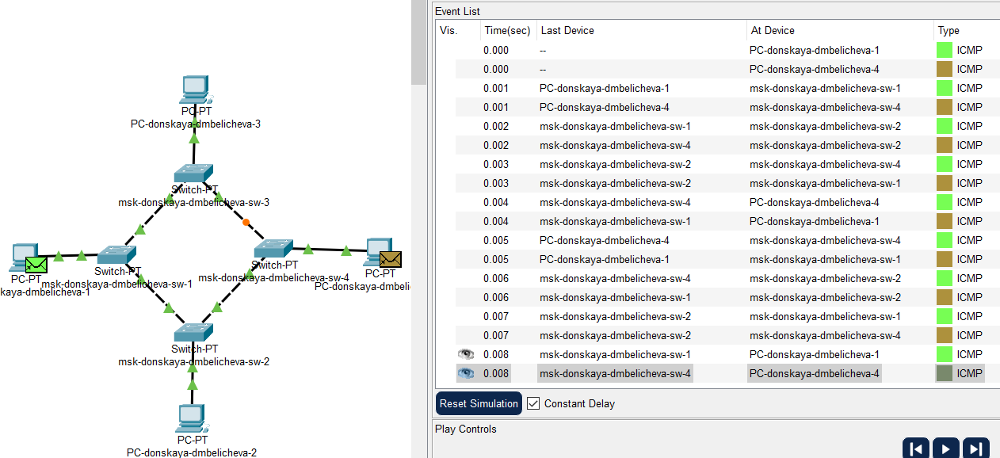
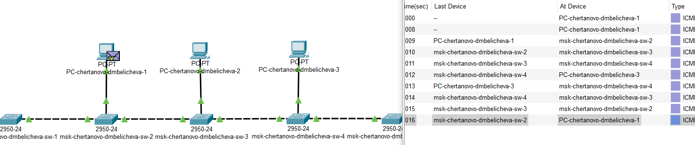
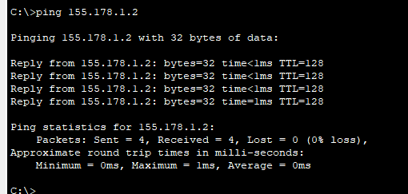

---
## Front matter
title: "Доклад"
subtitle: "Топология сети. Топологии типа «звезда», «кольцо», «шина»."
author: "Беличева Дарья Михайловна"

## Generic otions
lang: ru-RU
toc-title: "Содержание"

## Bibliography
bibliography: bib/cite.bib
csl: pandoc/csl/gost-r-7-0-5-2008-numeric.csl

## Pdf output format
toc: true # Table of contents
toc-depth: 2
lof: true # List of figures
lot: true # List of tables
fontsize: 12pt
linestretch: 1.5
papersize: a4
documentclass: scrreprt
## I18n polyglossia
polyglossia-lang:
  name: russian
  options:
	- spelling=modern
	- babelshorthands=true
polyglossia-otherlangs:
  name: english
## I18n babel
babel-lang: russian
babel-otherlangs: english
## Fonts
mainfont: PT Serif
romanfont: PT Serif
sansfont: PT Sans
monofont: PT Mono
mainfontoptions: Ligatures=TeX
romanfontoptions: Ligatures=TeX
sansfontoptions: Ligatures=TeX,Scale=MatchLowercase
monofontoptions: Scale=MatchLowercase,Scale=0.9
## Biblatex
biblatex: true
biblio-style: "gost-numeric"
biblatexoptions:
  - parentracker=true
  - backend=biber
  - hyperref=auto
  - language=auto
  - autolang=other*
  - citestyle=gost-numeric
## Pandoc-crossref LaTeX customization
figureTitle: "Рис."
tableTitle: "Таблица"
listingTitle: "Листинг"
lofTitle: "Список иллюстраций"
lotTitle: "Список таблиц"
lolTitle: "Листинги"
## Misc options
indent: true
header-includes:
  - \usepackage{indentfirst}
  - \usepackage{float} # keep figures where there are in the text
  - \floatplacement{figure}{H} # keep figures where there are in the text
---

# Введение

## Цель работы

Исследовать понятие топологии сети, а также рассмотреть конкретные топологии: "звезда", "кольцо", "шина".

## Задание

* Изучить понятие топологии сети;
* Рассмотреть топологии "звезда", "кольцо", "шина";
* Реализовать рассмотренные топологии в Cisco Packet Tracer.

# Понятие топологии сети

Сетевая топология — это конфигурация графа, вершинам которого соответствуют конечные узлы сети (компьютеры и коммуникационное оборудование (маршрутизаторы)), а рёбрам — физические или информационные связи между вершинами. Сетевой топологией является метод отображения конфигурации сети, схематическое представление сети и взаимных связей между оборудованием, которое входит в её состав [@wiki].

Сетевая топология может быть представлена следующими видами [@topology]:

1. Физическая топология, представляющая фактическое расположение оборудования и
взаимные связи между сетевыми узлами.

2. Логическая топология, представляющая сигнальное взаимодействие в области
физической топологии.

3. Информационная топология, представляющая описание движения потоков информации
внутри сети.

4. Топология регулирования обменов, описывающая принципы переадресации прав на
использование сети.

От выбора топологии связей существенно зависят характеристики сети.
Например, наличие между узлами нескольких путей повышает надежность
сети и делает возможным распределение загрузки между отдельными каналами.

Различают следующие топологии компьютерных сетей:

* полносвязную;
* ячеистую;
* кольцевую;
* звездообразную («звезда»);
* древовидную;
* общую шину;
* смешанную.

Небольшие сети, как правило, строятся по типовой топологии (звезда, кольцо или общая шина). Крупные сети обычно имеют смешанную топологию, которая объединяет отдельные подсети, имеющие разные типовые топологии.

# Топология "звезда"

В звездообразной топологии (рис. [-@fig:001]) каждый компьютер подключается при
помощи отдельного кабеля к общему центральному устройству, в функции которого входит направление передаваемой компьютером информации одному или всем остальным компьютерам сети.
В качестве такого центрального устройства чаще всего используется специальное сетевое оборудование: концентратор, коммутатор или маршрутизатор, однако может использоваться и универсальный компьютер с установленным специальным программным обеспечением и достаточным количеством коммуникационных портов [@seti].

{#fig:001 width=70%}

Если сеть строится с помощью иерархического соединения центральных
устройств нескольких сетей звездообразной топологии, то образуется топология дерево или иерархическая звезда. В настоящее время данная топология является самой распространенной как в локальных, так и в
глобальных сетях.

Эта топология возникла на заре вычислительной техники, когда компьютеры были подключены к центральному, главному, компьютеру.

Достоинства типологии "звезда":

* выход из строя одной рабочей станции не отражается на работе всей сети в целом
* хорошая масштабируемость сети
* лёгкий поиск неисправностей и обрывов в сети
* высокая производительность сети (при условии правильного проектирования)
* гибкие возможности администрирования

Недостатки типологии "звезда":

* выход из строя центрального концентратора обернётся неработоспособностью сети (или сегмента сети) в целом для прокладки сети зачастую требуется больше кабеля, чем для большинства других топологий
* конечное число рабочих станций в сети (или сегменте сети) ограничено количеством портов в центральном концентраторе.

# Топология "кольцо"

Кольцевая топология (рис. [-@fig:002]) - это своего рода схема сети, в которой каждое устройство связано с двумя другими устройствами. Это создает круговое кольцо взаимосвязанных устройств, которое и дало ему свое название. Данные обычно передаются в одном направлении по кольцу, известному как однонаправленное кольцо. Данные передаются с одного устройства на другое до тех пор, пока не достигнут определенного места назначения. В двунаправленном кольце данные могут передаваться в любом направлении [@seti].

{#fig:002 width=70%}

К достоинствам кольцевой топологии следует отнести:

* Простота установки.
* Фактически полное отсутствие дополнительного оборудования.
* Устойчивое функционирование без заметного падения скорости информационного
обмена при интенсивной загрузке сети.
* Кольцевая сеть организована предельно упорядоченно, где каждое устройство имеет доступ к токену и, следовательно, возможность передачи.

Тем не менее, кольцевая топология обладает и определёнными недостатками:

* Все рабочие станции обязаны принимать активное участие в пересылке информации.
Если выходит из строя хотя бы одна из рабочих станций или происходит обрыв кабеля, то
работа всей сети прекращается.
* Добавление и удаление любого узла в сети затруднено и может вызвать проблемы в сетевой активности.
* Сложная процедура поиска неисправностей.

# Топология "шина"

В топологии общая шина (рис. [-@fig:003]) все компьютеры подключаются к общему центральному элементу, в качестве которого выступает кабель или радио-среда
Передаваемая информация распространяется по общей шине и
доступна одновременно всем присоединенным к ней компьютерам, поэтому
задача каждого компьютера – проверить кому адресовано сообщение. Недостатком такой топологии является зависимость скорости передачи данных от количества подключенных узлов: чем больше компьютеров и других узлов,
тем ниже скорость передачи данных. Кроме этого, в случае повреждения
центрального кабеля полностью парализуется вся сеть [@seti].

{#fig:003 width=70%}

К преимуществам топологии «шина» следует отнести следующие аспекты:

* Сравнительно простая настройка.
* Относительно простой монтаж и небольшая стоимость, особенно когда все рабочие
станции расположены сравнительно недалеко друг от друга.
* Неисправность на одной или нескольких рабочих станциях никак не влияет на
работоспособность всей сети.

Недостатками топологии «шина» считаются следующие обстоятельства:

* Неисправности в самой шине (в любом её месте), такие как, например, обрыв кабеля,
выход из строя сетевых коннекторов, ведут к полному отказу сети.
* Достаточно сложный процесс поиска неисправностей.
* Низкий уровень производительности, поскольку в любой момент времени только один
компьютер способен транслировать данные в сеть, с возрастанием количества рабочих
станций производительность сети снижается.
* Наличие плохой масштабируемости, так как чтобы добавить новую рабочую станцию
нужно менять участки имеющейся шины.

# Практическая реализация топологий

## Реализация топологии "кольцо"

Запустим Cisco Packet Tracer и разместим в логической области четыре коммутатора PT и 4 оконечных устройства PC (рис. [-@fig:004]). Зададим им дисплейные имена в соответствии с соглашением об именование устройств. Для соединения устройств воспользуемся автоматическим кабелем.

{#fig:004 width=70%}

Настроем ПК (хосты) с IPv4-адресом и маской подсети в соответствии с таблицей IP-адресации (табл. [-@tbl:ip]).

:Таблица ip-адресов {#tbl:ip}

| №   | Устройство | IPv4-адрес  | Маска подсети |
| --- | ---------- | ----------- | ------------- |
| 1.  | pc0        | 192.168.0.1 | 255.255.255.0 |
| 2.  | pc1        | 192.168.0.2 | 255.255.255.0 |
| 3.  | pc2        | 192.168.0.3 | 255.255.255.0 |
| 4.  | pc3        | 192.168.0.4 | 255.255.255.0 |

IP-адрес можно задать через терминал, используя команду `ipconfig` (рис. [-@fig:005]). Повторим эту настройку для всех оконечных устройств сети.

{#fig:005 width=70%}
 
Также для задания ip-адреса можно использовать интерфейс Cisco. Нажав на устройство нам откроются возможные настройки, перейдя в режим конфигурации, зададим адрес и маску подсети (рис. [-@fig:006]). 

{#fig:006 width=70%}

Теперь проверим работоспособность подключения с помощью команды `ping` (рис. [-@fig:007]). Пингование проходит успешно, то есть подключение устройств выполнено корректно.

{#fig:007 width=70%}
 
Выполним симуляцию передачи PDU, чтобы посмотреть, как происходит движение пакетов.
Сначала отправим 1 пакет с ПК-1 на ПК-4, доставка пакета к ПК-4 и обратно проходит успешно, можем посмотреть список событий (рис. [-@fig:008]). Движение происходит по кольцу, благодаря коммутаторам пакет понимает, куда ему идти.

{#fig:008 width=70%}

Попробуем отправить два пакета одновременно (с ПК-1 на ПК-4 и с ПК-4 на ПК-1) (рис. [-@fig:009]). Увидим, что пакеты успешно доходят.

{#fig:009 width=70%}

## Реализация топологии "шина"

Разместим в логической области 5 коммутаторов 2950-24 и 3 оконечных устройства PC. Зададим им дисплейные имена в соответствии с соглашением об именование устройств (рис. [-@fig:010]). Для соединения коммутаторов между собой возьмем кроссовый кабель, а для подключение ПК к коммутаторам возьмем прямой кабель.

{#fig:010 width=70%}

Настроем ПК (хосты) с IPv4-адресом и маской подсети в соответствии с таблицей IP-адресации (табл. [-@tbl:ip2]).

:Таблица ip-адресов {#tbl:ip2}

| №   | Устройство | IPv4-адрес  | Маска подсети |
| --- | ---------- | ----------- | ------------- |
| 1.  | pc0        | 156.62.2.1  | 255.255.255.0 |
| 2.  | pc1        | 156.62.2.2  | 255.255.255.0 |
| 3.  | pc2        | 156.62.2.3  | 255.255.255.0 |

IP-адрес зададим через терминал, используя команду `ipconfig` (рис. [-@fig:011]). Повторим эту настройку для всех оконечных устройств сети.

{#fig:011 width=70%}

Теперь проверим работоспособность подключения с помощью команды `ping` (рис. [-@fig:012]). Пингование проходит успешно, то есть подключение устройств выполнено корректно.

{#fig:012 width=70%}

Выполним симуляцию передачи PDU, чтобы посмотреть, как происходит движение пакетов.
Сначала отправим 1 пакет (рис. [-@fig:013]). Благодаря коммутаторам пакет знает, куда ему идти. 

{#fig:013 width=70%}

Попробуем отправить два пакета одновременно (рис. [-@fig:014]). Увидим, что пакеты успешно доходят.

{#fig:014 width=70%}

Построим аналогичную топологию сети "шина", но с использованием концентраторов (рис. [-@fig:015]). 

{#fig:015 width=70%}

Выполним симуляцию передачи пакетов для этого случая (рис. [-@fig:016]). По списку событий видно, что пакет рассылается теперь по всем устройствам. Компьютеры, которым не предназначено сообщение не принимают его соответственно. Хабы на концах кабеля помогают поступившему сигналу не отражаться.

{#fig:016 width=70%}

## Реализация топологии "звезда"

Разместим в логической области 1 коммутатор 2950-24, 2 оконечных устройства PC и 2 лаптопа. Зададим им дисплейные имена в соответствии с соглашением об именование устройств (рис. [-@fig:017]). Для соединения оконечных устройств с коммутатором возьмем прямой кабель.

{#fig:017 width=70%}

Настроем ПК (хосты) с IPv4-адресом и маской подсети в соответствии с таблицей IP-адресации (табл. [-@tbl:ip3]).

:Таблица ip-адресов {#tbl:ip3}

| №   | Устройство | IPv4-адрес  | Маска подсети |
| --- | ---------- | ----------- | ------------- |
| 1.  | pc0        | 155.178.1.1 | 255.255.255.0 |
| 2.  | pc1        | 155.178.1.2 | 255.255.255.0 |
| 3.  | pc2        | 155.178.1.3 | 255.255.255.0 |
| 4.  | pc3        | 155.178.1.4 | 255.255.255.0 |

IP-адрес зададим через терминал, используя команду `ipconfig` (рис. [-@fig:018]). Повторим эту настройку для всех оконечных устройств сети.

{#fig:018 width=70%}

Теперь проверим работоспособность подключения с помощью команды `ping` (рис. [-@fig:019]). Пингование проходит успешно, то есть подключение устройств выполнено корректно.

{#fig:019 width=70%}

Выполним симуляцию передачи PDU, чтобы посмотреть, как происходит движение пакетов.
Отправим 2 пакета одновременно (рис. [-@fig:020]). Отправка проходит успешно.

{#fig:020 width=70%}

Если нам надо масштабировать сеть, то мы можем сделать "иерархическую звезду" (рис. [-@fig:021]). 

{#fig:021 width=70%}

# Выводы

В результате выполнения работы я исследовала понятие топологии сети, а также рассмотрела конкретные топологии: "звезда", "кольцо", "шина".

# Список литературы{.unnumbered}

::: {#refs}
:::
