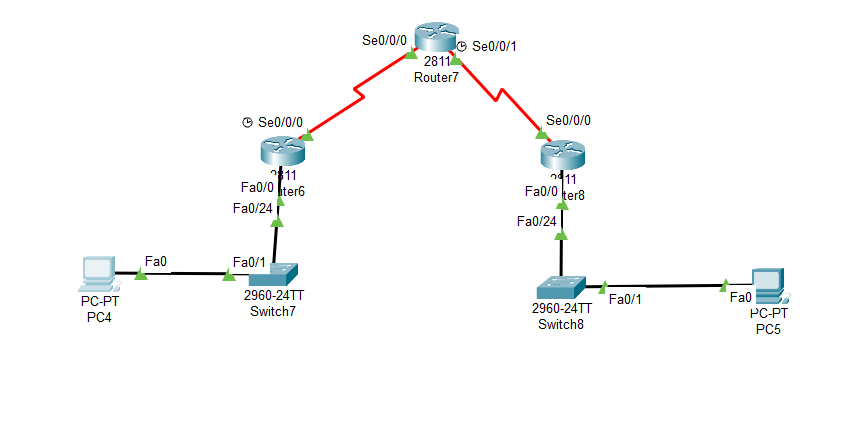
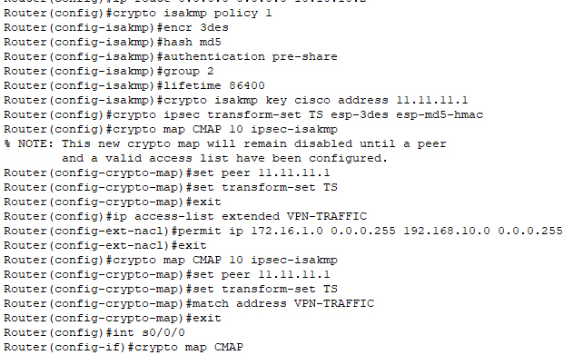
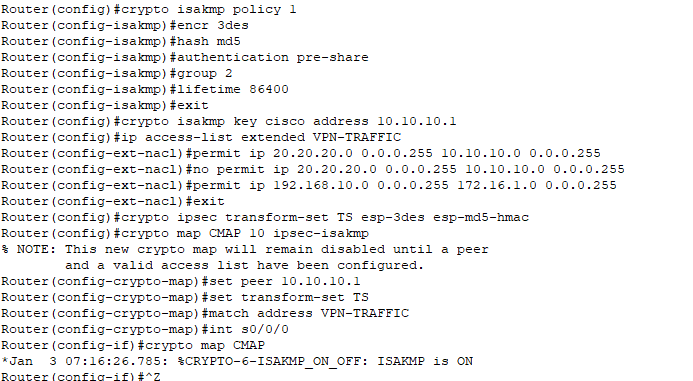
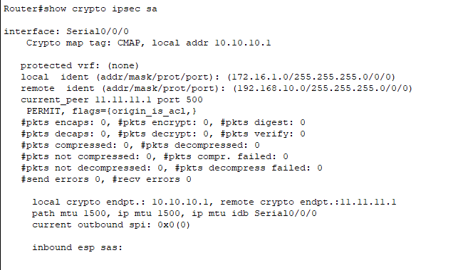
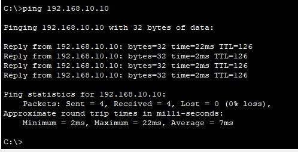
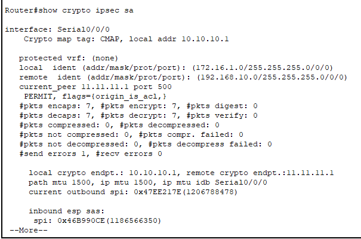

---
## Front matter
lang: ru-RU
title: Доклад
subtitle: Настройка VPN.
author:
  - Беличева Д. М.
institute:
  - Российский университет дружбы народов, Москва, Россия

## i18n babel
babel-lang: russian
babel-otherlangs: english

## Formatting pdf
toc: false
toc-title: Содержание
slide_level: 2
aspectratio: 169
section-titles: true
theme: metropolis
header-includes:
 - \metroset{progressbar=frametitle,sectionpage=progressbar,numbering=fraction}
 - '\makeatletter'
 - '\beamer@ignorenonframefalse'
 - '\makeatother'
---

# Информация

## Докладчик

:::::::::::::: {.columns align=center}
::: {.column width="70%"}

  * Беличева Дарья Михайловна
  * студентка
  * Российский университет дружбы народов
  * [1032216453@pfur.ru](mailto:1032216453@pfur.ru)
  * <https://dmbelicheva.github.io/ru/>

:::
::: {.column width="25%"}


:::
::::::::::::::

## Вводная часть

**Цель работы**

Исследовать понятие и основные характеристики VPN, а также изучить ее настройку.

**Задание**

* Изучить понятие VPN;
* Рассмотреть протоколы VPN;
* Реализовать практический пример настройки VPN в Cisco Packet Tracer.

## Понятие топологии сети

Виртуальная частная сеть (Virtual Private Network, VPN) — технология,
обеспечивающая одно или несколько сетевых соединений поверх другой сети.

## Структура VPN

- **VPN-клиент**;

- **VPN-сервер**;

- **Аутентификация**;

- **Туннелирование**;

- **Шифрование**.

## Структура VPN

1. Инициация соединения;

2. Аутентификация;

3. Шифрование данных;

4. Передача данных;

5. Ответные данные.

## Виды VPN-соединений

- **Client-to-Site VPN и Remote Access VPN**

- **Узел-узел, или Site-to-Site VPN**

- **Точка-многоточка, или Point-to-Multipoint VPN (P2MP)**

## Протоколы VPN

- **PPTP**

- **SSTP**

- **IPsec**

- **L2TP/IPsec**

- **IKEv2/IPsec**

- **OpenVPN**

- **WireGuard**

## Практическая пример настройки VPN

```
R2(config)# crypto isakmp policy 1
R2(config-isakmp)# encr 3des
R2(config-isakmp)# hash md5
R2(config-isakmp)# authentication pre-share
R2(config-isakmp)# group 2
R2(config-isakmp)# lifetime 86400
```

## Практическая пример настройки VPN

```
R2(config)# crypto isakmp key merionet address 1.1.1.1
R2(config)# ip access-list extended VPN-TRAFFIC
R2(config-ext-nacl)# permit ip 20.20.20.0 0.0.0.255 10.10.10.0 0.0.0.255
```

## Практическая пример настройки VPN

```
R2(config)# crypto ipsec transform-set TS esp-3des esp-md5-hmac
R2(config)# crypto map CMAP 10 ipsec-isakmp
R2(config-crypto-map)# set peer 1.1.1.1
R2(config-crypto-map)# set transform-set TS
R2(config-crypto-map)# match address VPN-TRAFFIC
```

## Практический пример настройки VPN

```
R2(config)# interface FastEthernet0/1
R2(config- if)# crypto map CMAP
```

## Практическая пример настройки VPN

{#fig:005 width=70%}

## Практическая пример настройки VPN

{#fig:005 width=70%}

## Практическая пример настройки VPN

{#fig:005 width=70%}

## Практическая пример настройки VPN

{#fig:005 width=70%}

## Практическая пример настройки VPN

{#fig:005 width=70%}

## Практическая пример настройки VPN

{#fig:005 width=70%}

## Практическая пример настройки VPN

{#fig:005 width=70%}

## Выводы

В результате выполнения работы я исследовала понятие и основные характеристики VPN, а также изучила ее настройку.