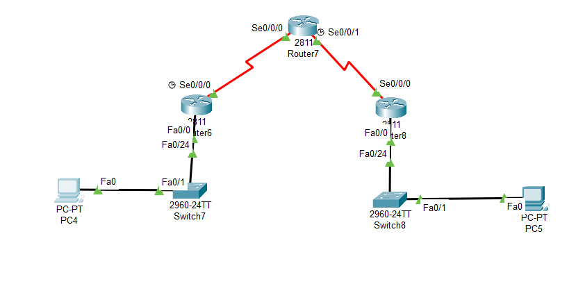
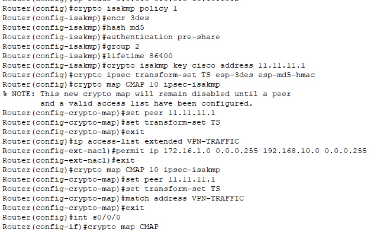
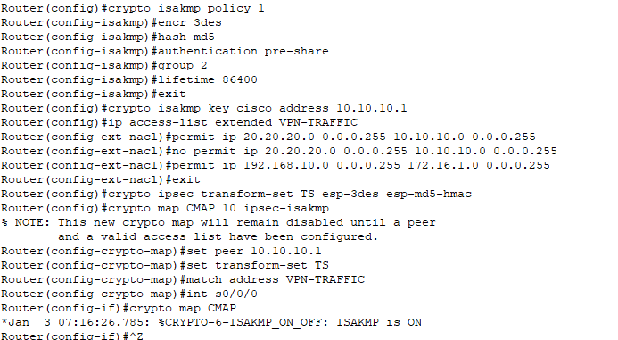
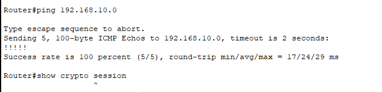
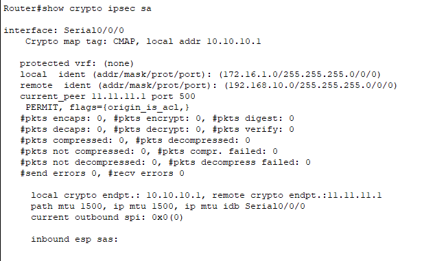
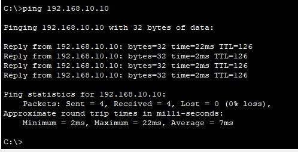
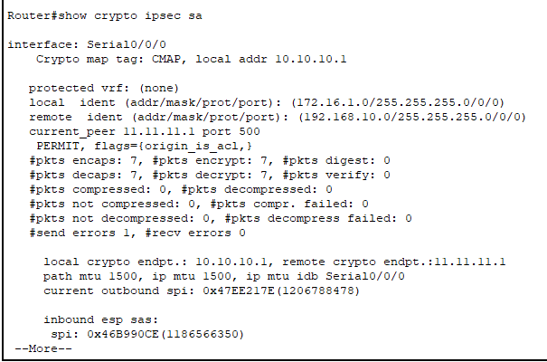

---
## Front matter
title: "Доклад"
subtitle: "Настройка VPN"
author: "Беличева Дарья Михайловна"

## Generic otions
lang: ru-RU
toc-title: "Содержание"

## Bibliography
bibliography: bib/cite.bib
csl: pandoc/csl/gost-r-7-0-5-2008-numeric.csl

## Pdf output format
toc: true # Table of contents
toc-depth: 2
lof: true # List of figures
lot: false # List of tables
fontsize: 12pt
linestretch: 1.5
papersize: a4
documentclass: scrreprt
## I18n polyglossia
polyglossia-lang:
  name: russian
  options:
	- spelling=modern
	- babelshorthands=true
polyglossia-otherlangs:
  name: english
## I18n babel
babel-lang: russian
babel-otherlangs: english
## Fonts
mainfont: PT Serif
romanfont: PT Serif
sansfont: PT Sans
monofont: PT Mono
mainfontoptions: Ligatures=TeX
romanfontoptions: Ligatures=TeX
sansfontoptions: Ligatures=TeX,Scale=MatchLowercase
monofontoptions: Scale=MatchLowercase,Scale=0.9
## Biblatex
biblatex: true
biblio-style: "gost-numeric"
biblatexoptions:
  - parentracker=true
  - backend=biber
  - hyperref=auto
  - language=auto
  - autolang=other*
  - citestyle=gost-numeric
## Pandoc-crossref LaTeX customization
figureTitle: "Рис."
tableTitle: "Таблица"
listingTitle: "Листинг"
lofTitle: "Список иллюстраций"
lotTitle: "Список таблиц"
lolTitle: "Листинги"
## Misc options
indent: true
header-includes:
  - \usepackage{indentfirst}
  - \usepackage{float} # keep figures where there are in the text
  - \floatplacement{figure}{H} # keep figures where there are in the text
---

# Введение

## Цель работы

Исследовать понятие и основные характеристики VPN, а также изучить ее настройку.

## Задачи

* Изучить понятие VPN;
* Рассмотреть протоколы VPN;
* Реализовать практический пример настройки VPN в Cisco Packet Tracer.

# Понятие VPN

Виртуальная частная сеть (Virtual Private Network, VPN) — технология,
обеспечивающая одно или несколько сетевых соединений поверх другой сети
(например, Интернет).

VPN создает локальную сеть между несколькими компьютерами в
сегментах сети. Машины могут находиться как в одной локальной сети, так и
могут быть удалены на большом расстоянии друг от друга через Интернет или они могут
даже быть подключены через специальные
мультимедиа (беспроводные каналы связи, спутниковая связь, коммутируемая сеть). VPN
поставляется с дополнительной защитой, чтобы сделать виртуальную сеть
частной. Сетевой трафик проходящий через VPN часто называют внутренним
туннелем по сравнению с другими трафиками который находится за
пределами туннеля.

VPN (Virtual Private Network) имеет множество преимуществ, связанных с безопасностью, конфиденциальностью и доступом в интернете. VPN шифрует интернет-трафик, защищая данные от хакеров и интернет-провайдеров, что особенно важно в общедоступных Wi-Fi сетях. Он скрывает реальный IP-адрес, предотвращая отслеживание местоположения и онлайн-активности.
VPN помогает обходить цензуру и географические ограничения, предоставляя доступ к заблокированным сайтам и региональному контенту. Он также незаменим для безопасной работы в корпоративных сетях, позволяя сотрудникам удаленно подключаться к корпоративным ресурсам и защищая корпоративные данные от несанкционированного доступа.
VPN защищает от атак типа «человек посередине» и блокирует вредоносные веб-сайты и фишинговые атаки. Он также позволяет экономить на покупках, предоставляя доступ к региональным ценам на товары и услуги в интернете.
Примеры использования VPN включают защиту личной информации в общедоступных Wi-Fi сетях, обход географических ограничений, безопасную удаленную работу и анонимный серфинг. В современном цифровом мире, где угрозы кибербезопасности и ограничения доступа становятся все более распространенными, VPN является мощным инструментом для обеспечения безопасности и конфиденциальности

# Структура VPN

Структура VPN включает несколько ключевых компонентов:

- **VPN-клиент**: Программное обеспечение на устройстве пользователя, которое инициирует соединение с VPN-сервером;
- **VPN-сервер**: Сервер, который обрабатывает запросы от VPN-клиента и обеспечивает доступ к защищенной сети;
- **Аутентификация**: Процесс проверки подлинности пользователя и устройства;
- **Туннелирование**: Процесс инкапсуляции одного сетевого протокола внутри другого для обеспечения защиты данных;
- **Шифрование**: Технология, которая обеспечивает конфиденциальность данных, передаваемых через VPN. В момент передачи данных VPN шифрует их, тем самым защищает туннель передачи. С помощью специальных алгоритмов информация преобразуется в нечитаемый вид для третьих лиц.

Исходя из этой структуры, можно описать шаги работы VPN:

1. Инициация соединения

Сначала пользователь запускает VPN-клиента и вводит свои учетные данные (логин и пароль), после чего VPN-клиент устанавливает соединение с VPN-сервером через интернет.

2. Аутентификация
 
Далее VPN-сервер проверяет учетные данные пользователя. После успешной аутентификации создается защищенный туннель между клиентом и сервером.

3. Шифрование данных

Теперь VPN-клиент шифрует данные перед их отправкой через туннель. Благодаря шифрованию данные не могут быть прочитаны третьими лицами в случае перехвата.

4. Передача данных:

Зашифрованные данные передаются через интернет к VPN-серверу. VPN-сервер в свою очередь дешифрует данные и направляет их к целевому ресурсу (например, веб-сайту или корпоративной сети).

5. Ответные данные:

Наконец, данные, полученные от целевого ресурса, также шифруются VPN-сервером, затем они передаются обратно через туннель к VPN-клиенту, который их дешифрует и передает пользователю.
 
# Виды VPN-соединений

**Client-to-Site VPN и Remote Access VPN**

Данный тип VPN позволяет отдельным пользователям и устройствам безопасно подключаться в рамках общедоступной сети к частной сети компании. Удаленный доступ осуществляется с помощью установки соединения между пользователем и VPN-сервером, расположенным внутри сети организации. Для этого используются специальные протоколы, среди которых — IPSec, OpenVPN, SSL/TLS и другие.

**Узел-узел, или Site-to-Site VPN**

Это тип VPN-соединения, который используют для организации связности двух сетей. В данном случае используется шифрованный туннель между локальными сетями, в которых находятся хосты А и Б соответственно. Site-to-Site VPN позволяет работать так, будто они подключены к одному коммутатору. 

Установить данный тип соединения несложно. Достаточно на границе сайта установить VPN-шлюз — например, файрвол. Он будет отвечать за обмен ключами, шифрование и дешифрование данных, а также за согласование параметров VPN-туннеля.

**Точка-многоточка, или Point-to-Multipoint VPN (P2MP)**

Данный тип соединения позволяет связать один VPN-шлюз с несколькими удаленными. При этом все последние могут обмениваться данными между собой, а не только с начальным устройством. Данная технология может быть полезна при создании виртуальной сети между различными филиалами организации.

# Протоколы VPN

Протоколы VPN — это специальные правила, определяющие порядок работы виртуальной частной сети. Они отвечают за процессы аутентификации устройств, способы передачи данных, безопасность используемых алгоритмов и приватность соединения.

**PPTP**

PPTP (Point-to-Point Tunneling Protocol) — один из первых VPN-протоколов. Компания Microsoft разработала его для коммутируемых сетей в Windows 95 и Windows NT. Примитивное шифрование делает его сверхбыстрым, но из-за этого страдает безопасность в интернете. К сожалению, он не дожил до наших дней и в настоящее время считается устаревшим. 

PPTP использует протокол MPPE (Microsoft Point-to-Point Encryption) с ключами длиной до 128 бит. Для аутентификации он может использовать либо MS-CHAPv1, либо MS-CHAPv2. Совокупность этих факторов делает его открытым к разным атакам: от перебора до подмены битов.

Низкоуровневое шифрование делает PPTP одним из самых быстрых VPN-протоколов. Шифрование обычно замедляет скорость соединения, но у PPTP он слишком мал, чтобы вызвать значительную разницу.

PPTP использует два соединения — одно для управления, другое для инкапсуляции данных. Первое работает с использованием TCP, в котором порт сервера 1723. Второе работает с помощью протокола GRE, который является транспортным протоколом (то есть заменой TCP/UDP). Этот факт мешает клиентам, находящимся за NAT, установить подключение с сервером, так как для них установление подключения точка-точка не представляется возможным по умолчанию. Однако, поскольку в протоколе GRE, что использует PPTP (а именно enhanced GRE), есть заголовок Call ID, маршрутизаторы, выполняющие натирование, могут идентифицировать и сопоставить GRE трафик, идущий от клиента локальной сети к внешнему серверу и наоборот. Это дает возможность клиентам за NAT установить подключение point-to-point и пользоваться протоколом GRE. Данная технология называется VPN PassTrough. Она поддерживается большим количеством современного клиентского сетевого оборудования.

PPTP поддерживается нативно на всех версиях Windows и большинстве других операционных систем. Несмотря на относительно высокую скорость, PPTP не слишком надежен: после обрыва соединения он не восстанавливается так же быстро, как, например, OpenVPN.

В настоящее время PPTP по существу устарел и Microsoft советует пользоваться другими VPN решениями. 

**SSTP**

SSTP (Secure Socket Tunneling Protocol) — еще один протокол от Microsoft, который впервые появился в Windows Vista.  Его изначально рассматривали как преемника PPTP и L2TP, поэтому SSTP можно найти в более поздних версиях Windows. По уровню безопасности он практически не уступает OpenVPN и способен обходить межсетевые экраны. 

SSTP отправляет трафик по SSL через TCP-порт 443. Это делает его полезным для использования в ограниченных сетевых ситуациях, например, если вам нужен VPN для Китая. Несмотря на то, что SSTP также доступен и на Linux, RouterOS и SEIL, по большей части он все равно используется Windows-системами.

Относительно скорости SSTP работает быстрее других протоколов. Однако он требует большей пропускной способности и мощного процессора. Немногие VPN провайдеры поддерживают SSTP.

SSTP может выручить, если блокируются другие VPN протоколы, но опять-таки OpenVPN будет лучшим выбором (если он доступен).


**IPsec**

IPsec VPN — это набор протоколов, который защищает соединение между устройствами на уровне IP. Существует два режима работы IPsec: туннельный и транспортный. 

Туннельный режим. IPsec VPN шифрует исходный IP-пакет и инкапсулирует его в новый заголовок. Туннель прокладывается между парой шлюзов — например, двумя маршрутизаторами или маршрутизатором и межсетевым экраном. Аутентификация выполняется на обоих концах соединения, путем добавления к пакету заголовка. В транспортном режиме шифруется только полезная нагрузка IP-пакета без начального заголовка.

Туннельный режим обычно безопаснее транспортного, поскольку шифрует не только полезную нагрузку, но и весь IP-пакет.

Транспортный режим. Он отличается от туннельного методом инкапсуляции: шифрует только данные, а заголовок IP оставляет без изменений. Поэтому транспортный режим менее безопасный.

Ядро IPSec базируется на трех протоколах:

Authentication Header (AH) обеспечивает аутентификацию и поддерживает целостность данных,
ESP или Encapsulating Security Payload отвечает за шифрование трафика,
ISAKMP или Internet Security Association and Key Management Protocol отвечает за обмен ключами и аутентификацию конечных хостов.


**L2TP/IPsec**

Layer 2 Tunneling Protocol (L2TP) был впервые предложен в 1999 году в качестве обновления протоколов L2F (Cisco) и PPTP (Microsoft). Поскольку L2TP сам по себе не обеспечивает шифрование или аутентификацию, часто с ним используется IPsec. L2TP в паре с IPsec поддерживается многими операционными системами, стандартизирован в RFC 3193.

L2TP/IPsec считается безопасным и не имеет серьезных выявленных проблем (гораздо безопаснее, чем PPTP). L2TP/IPsec может использовать шифрование 3DES или AES, хотя, учитывая, что 3DES в настоящее время считается слабым шифром, он используется редко.

У протокола L2TP иногда возникают проблемы из-за использования по умолчанию UDP-порта 500, который, как известно, блокируется некоторыми брандмауэрами.

Протокол L2TP/IPsec позволяет обеспечить высокую безопасность передаваемых данных, прост в настройке и поддерживается всеми современными операционными системами. Однако L2TP/IPsec инкапсулирует передаваемые данные дважды, что делает его менее эффективным и более медленным, чем другие VPN-протоколы.

**IKEv2/IPsec**

Internet Key Exchange version 2 (IKEv2) является протоколом IPsec, используемым для выполнения взаимной аутентификации, создания и обслуживания Security Associations (SA), стандартизован в RFC 7296. Так же защищен IPsec, как и L2TP, что может говорить об их одинаковом уровне безопасности. Хотя IKEv2 был разработан Microsoft совместно с Cisco, существуют реализации протокола с открытым исходным кодом (например, OpenIKEv2, Openswan и strongSwan).

Благодаря поддержке Mobility and Multi-homing Protocol (MOBIKE) IKEv2 очень устойчив к смене сетей. Это делает IKEv2 отличным выбором для пользователей смартфонов, которые регулярно переключаются между домашним Wi-Fi и мобильным соединением или перемещаются между точками доступа.

IKEv2/IPsec может использовать ряд различных криптографических алгоритмов, включая AES, Blowfish и Camellia, в том числе с 256-битными ключами.

IKEv2 работает через UDP-протокол, что обеспечивает низкую задержку и высокую скорость. Эффективный обмен сообщениями типа «запрос-ответ» также играет важную роль. Кроме того, IKEv2 менее требователен к процессору, чем OpenVPN.

Во многих случаях IKEv2 быстрее OpenVPN, так как он менее ресурсоемкий. С точки зрения производительности IKEv2 может быть лучшим вариантом для мобильных пользователей, потому как он хорошо переустанавливает соединения. IKEv2 нативно поддерживается на Windows 7+, Mac OS 10.11+, iOS, а также на некоторых Android-устройствах.

**OpenVPN**

OpenVPN — это универсальный протокол VPN с открытым исходным кодом, разработанный компанией OpenVPN Technologies. На сегодняшний день это, пожалуй, самый популярный протокол VPN. Будучи открытым стандартом, он прошел не одну независимую экспертизу безопасности.

В большинстве ситуаций, когда нужно подключение через VPN, скорее всего подойдет OpenVPN. Он стабилен и предлагает хорошую скорость передачи данных. OpenVPN использует стандартные протоколы TCP и UDP и это позволяет ему стать альтернативой IPsec тогда, когда провайдер блокирует некоторые протоколы VPN.

Для работы OpenVPN нужно специальное клиентское программное обеспечение, а не то, которое работает из коробки. Большинство VPN-сервисов создают свои приложения для работы с OpenVPN, которые можно использовать в разных операционных системах и устройствах. Протокол может работать на любом из портов TCP и UPD и может использоваться на всех основных платформах через сторонние клиенты: Windows, Mac OS, Linux, Apple iOS, Android.

В плане скорости протокол занимает промежуточное место. Он быстрее, чем L2TP/IPSec, но медленнее, чем PPTP и WireGuard. Однако скорость всегда зависит от устройства и параметров конфигурации. К примеру, его можно увеличить за счет функции раздельного туннелирования или уменьшить с помощью двойного шифрования.

**WireGuard**

Протокол появился в 2018 году и успел завоевать большую популярность. Он использует шифр ChaCha20, описанный в RFC 7539, и имеет около четырех тысяч строк кода, что значительно упрощает и ускоряет аудит безопасности. Основной минус: он не умеет динамически назначать IP-адреса пользователям, подключенным к серверу. Поэтому статический IP должен храниться на том же сервере. 

WireGuard — самый быстрый по сравнению с другими VPN-протоколами, поскольку не использует туннелирование по TCP в принципе. Linux-системы обеспечивают наилучшую работу протокола с помощью интеграции в модуль ядра.

Все IP-пакеты, приходящие на WireGuard интерфейс, инкапсулируются в UDP и безопасно доставляются другим пирам.


## Реализация топологии "звезда"

```
R2(config)# crypto isakmp policy 1
R2(config-isakmp)# encr 3des
R2(config-isakmp)# hash md5
R2(config-isakmp)# authentication pre-share
R2(config-isakmp)# group 2
R2(config-isakmp)# lifetime 86400

R2(config)# crypto isakmp key merionet address 1.1.1.1
R2(config)# ip access-list extended VPN-TRAFFIC
R2(config-ext-nacl)# permit ip 20.20.20.0 0.0.0.255 10.10.10.0 0.0.0.255
 
R2(config)# crypto ipsec transform-set TS esp-3des esp-md5-hmac
R2(config)# crypto map CMAP 10 ipsec-isakmp
R2(config-crypto-map)# set peer 1.1.1.1
R2(config-crypto-map)# set transform-set TS
R2(config-crypto-map)# match address VPN-TRAFFIC

R2(config)# interface FastEthernet0/1
R2(config- if)# crypto map CMAP
```

{#fig:001 width=70%}

{#fig:002 width=70%}

{#fig:003 width=70%}

{#fig:004 width=70%}

{#fig:005 width=70%}

{#fig:006 width=70%}

{#fig:007 width=70%}

# Выводы

В результате выполнения работы я исследовала понятие и основные характеристики VPN, а также изучила ее настройку.